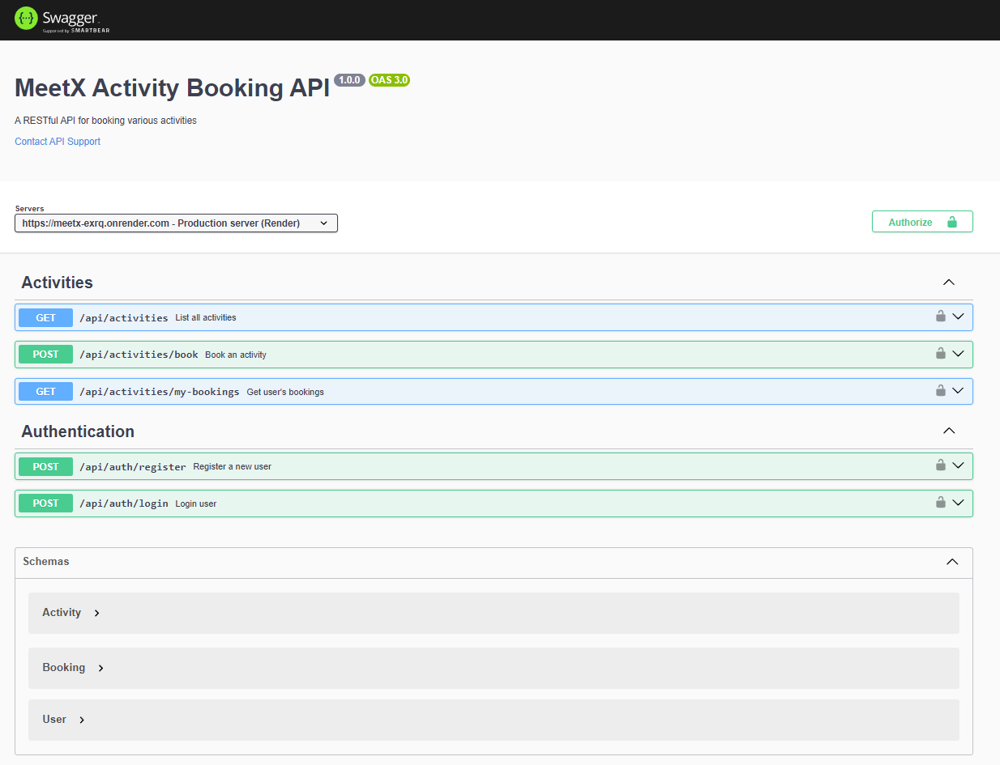

# MeetX Activity Booking API

A RESTful API for booking various activities like yoga, coding workshops, sports events, and more.

## Project Screenshot

Below is an image from the project showing the API functionality:



## Features

- User Registration and Authentication
- Activity Listing with 20 pre-seeded diverse activities
- Activity Booking with capacity management
- Booking History
- JWT-based Authentication
- Input Validation
- Password Hashing
- Swagger API Documentation

## Tech Stack

- Node.js
- Express.js
- MongoDB
- JWT Authentication
- Express Validator
- Bcrypt for Password Hashing
- Swagger for API Documentation

## Prerequisites

- Node.js (v14 or higher)
- MongoDB
- npm or yarn

## Setup Instructions

1. Clone the repository:

```bash
git clone <repository-url>
cd meetx-activity-booking
```

2. Install dependencies:

```bash
npm install
```

3. Create a `.env` file in the root directory with the following variables:

```
PORT=3000
MONGODB_URI=mongodb://localhost:27017/meetx
JWT_SECRET=your_jwt_secret_key
```

4. Seed the database with sample activities:

```bash
node src/scripts/seed-activities.js
```

5. Start the development server:

```bash
npm run dev
```

## API Endpoints

### Authentication

- POST `/api/auth/register` - Register a new user
- POST `/api/auth/login` - Login user

### Activities

- GET `/api/activities` - List all activities
- POST `/api/activities/book` - Book an activity (requires authentication)
- GET `/api/activities/my-bookings` - Get user's bookings (requires authentication)

## API Documentation with Swagger

Swagger API documentation is available at:
[API Documentation - MeetX](https://meetx-exrq.onrender.com/api-docs/)

⚠️ Note: Deployed on Render (Free Version)
The API is deployed on Render's free tier, so it may take 50-60 seconds for the first request to load due to cold start.

If you are testing locally, you can access Swagger UI at `/api-docs` on your local server.

## Database Options

- By default, the API is configured to use the deployed MongoDB instance.
- If you prefer, you can use your local MongoDB instance by changing the `MONGODB_URI` in the `.env` file.

## Sample Activities

The system comes pre-seeded with 20 diverse activities including:

- Morning Yoga Session
- Coding Workshop: React Basics
- Photography Walk
- Cooking Class: Italian Cuisine
- Hiking Adventure
- Public Speaking Workshop
- Chess Tournament
- Wine Tasting Evening
- Dance Class: Salsa
- Startup Networking Event
- And more...

Each activity has:

- A descriptive title
- Detailed description
- Specific location
- Future date
- Capacity limit
- Current booking count

## Testing

A Postman collection is provided in the `postman` directory for testing the APIs.

## Error Handling

The API uses standard HTTP status codes:

- 200: Success
- 201: Created
- 400: Bad Request (e.g., activity is full, already booked)
- 401: Unauthorized
- 404: Not Found
- 500: Internal Server Error

## Security

- Passwords are hashed using bcrypt
- JWT tokens are used for authentication
- Input validation using express-validator
- CORS enabled
- Environment variables for sensitive data
